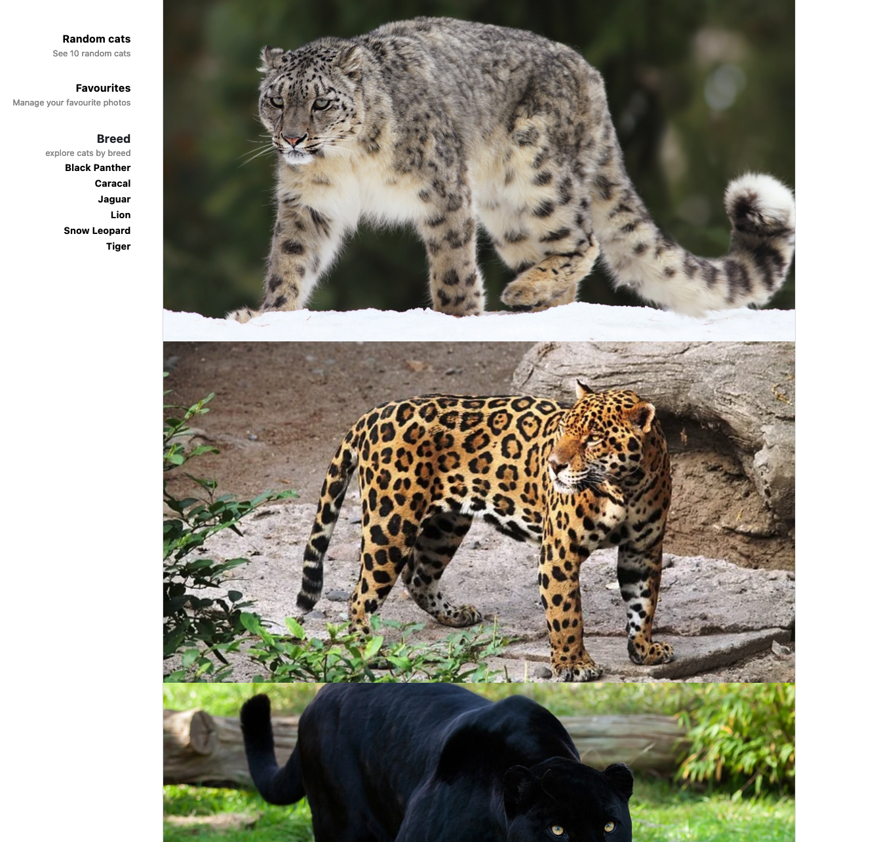

# GlobalWebIndex Engineering Challenge

## ReactJS Front-end app

This is a simple ReactJS app built using ReactJS 17 with Typescript and Jest/Enzyme for testing. State management is implemented using React Hooks. Bootstrap 5 has been used for styling and Axios for http communications. The following screenshot gives a taste of the actual home page.

## Deployment

The local [Dockerfile](Dockerfile) can be used to build and run the app on node docker image.

___

